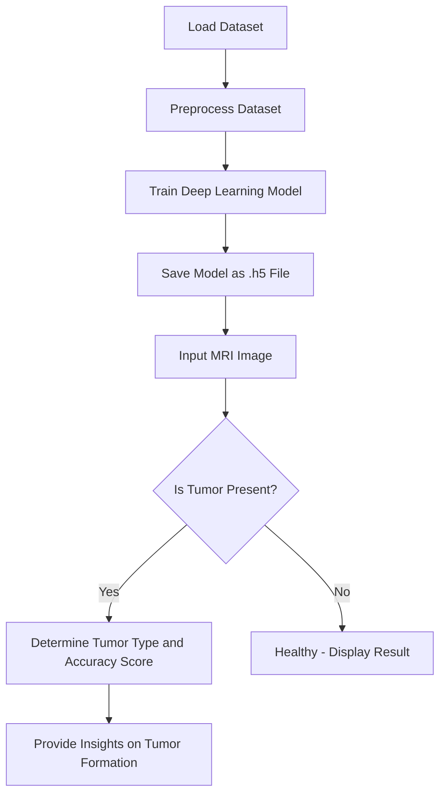

# Brain Tumor Detection System

This project utilizes deep learning to detect and classify brain tumors from MRI images. The primary objective is to determine whether a tumor is present and, if so, classify its type with high accuracy.

## Features
- **Dataset Handling**: Prepares and processes the MRI images for training.
- **Deep Learning Model**: Trains a Convolutional Neural Network (CNN) for tumor classification.
- **Prediction System**: Detects the presence of a tumor and identifies its type with an accuracy score.
- **Future Prediction**: Provides insights into the likelihood of tumor formation.

## Workflow
1. **Dataset Preparation**: Curated MRI image dataset is preprocessed.
2. **Model Training**: A deep learning model is trained and saved as an `.h5` file for later use.
3. **Prediction**: An MRI image is input, and the system determines:
   - If a tumor is present.
   - The type of tumor and its likelihood.
4. **Results**: Outputs a classification report and accuracy score.

## Technologies Used
- **Backend**: Flask is used to create the web server and handle requests.
- **Frontend**: HTML, CSS, and JavaScript are used to create the user interface for uploading images and displaying results.
- **Machine Learning**: TensorFlow and Keras libraries are utilized to build and train the CNN model.
- **Data Visualization**: Matplotlib and Seaborn are used for plotting graphs and visualizing model performance.
- **Database**: SQLite is integrated to store user inputs and results (optional).
- **Deployment**: The app can be deployed on platforms like Heroku or AWS for broader accessibility.

## 🔄 Workflow Diagram


## How the App Works
1. **Input**: The user uploads an MRI image through the web interface.
2. **Processing**:
   - The image is preprocessed and passed to the trained deep learning model.
   - The model predicts whether a tumor is present.
3. **Output**:
   - If a tumor is detected, the app determines the type of tumor and displays the classification along with a confidence score.
   - If no tumor is detected, the app informs the user that the MRI scan appears healthy.
4. **Insights**:
   - The app provides additional insights, such as the likelihood of tumor formation based on the analysis.

## Project Structure
- **app.py**: The main backend script to deploy the trained model and process user requests.
- **project3.ipynb**: Jupyter notebook for training and evaluating the CNN model.
- **design.png**: Visual representation of the project's workflow.
- **models/**: Directory for storing saved models (.h5 files).
- **static/**: Static files such as images and CSS for the web interface.
- **templates/**: HTML templates for rendering the web pages.

## Setup Instructions
### Prerequisites
- Python 3.8+
- Required Python libraries: `tensorflow`, `flask`, `numpy`, `pandas`, `matplotlib`, `seaborn`, and `sklearn`.

### Installation
1. Clone the repository:
   ```bash
   git clone <repository_url>
   cd <repository_directory>
   ```
2. Install dependencies:
   ```bash
   pip install -r requirements.txt
   ```
3. Train the model (optional):
   - Open `project3.ipynb` and run all the cells to train and save the model.
4. Start the application:
   ```bash
   python app.py
   ```
5. Access the application:
   Open a browser and navigate to `http://127.0.0.1:5000`.

## Usage
1. Upload an MRI image through the web interface.
2. View the prediction results:
   - Tumor presence.
   - Tumor type classification.
   - Prediction likelihood.

## Results
- Achieved an accuracy of 99%.
- Demonstrates the potential for early detection and diagnosis of brain tumors.

## Future Enhancements
- Integration with cloud storage for large-scale datasets.
- Real-time MRI image processing with edge devices.
- Incorporating additional diagnostic metrics.

## License
This project is licensed under the MIT License. See the [LICENSE](LICENSE) file for details.
